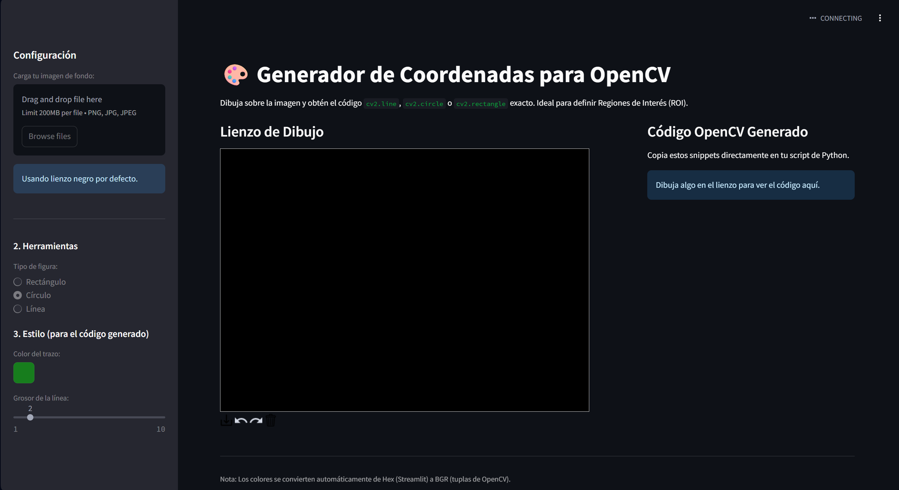

# OpenCV Drawer



Es un programa basante sencillo para ahorrarme 325654765 siglos en dibujar en OpenCV para mis proyectos de detección de objetos. Realmente no tiene nada de especial mas allá de que cumple con mis objetivos de lo que necesito.

Eres libre de hacer lo que te salga de la mente. 

## Correr en local

Clona el proyecto y corre el ```requirements.txt``` usando pip, instalando todas las dependencias y ejecuta la siguiente linea en la raiz del proyecto:

```
streamlit run main.py
```
